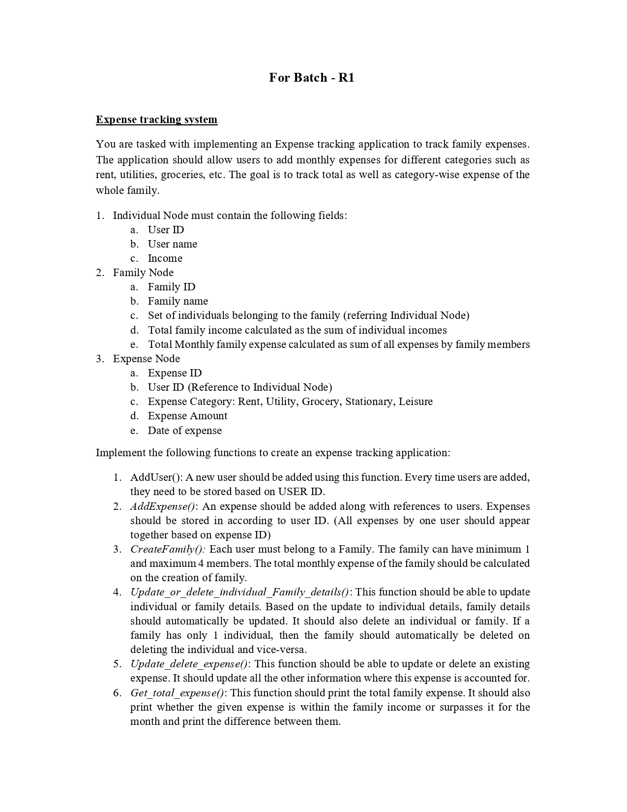
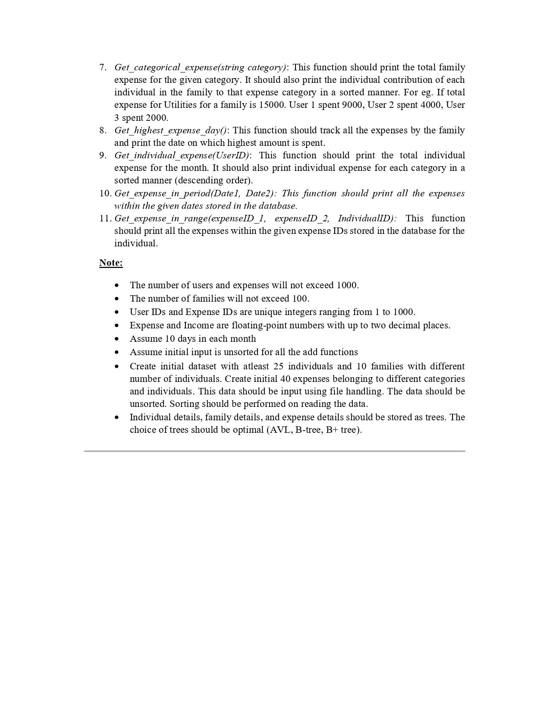

# 🧾 Family Expense Tracker

## 📌 Overview

The **Family Expense Tracker** is a C-based console application designed to efficiently track and manage expenses across families and individual users. This project offers two distinct implementations — one using **Linked Lists** and another using **B-Trees** — to provide insights into both data structures and how they impact data handling, access, and storage efficiency.

The application supports a variety of functionalities, including user and expense management, family grouping, and real-time expense analytics. It utilizes file handling to persist data across sessions.

---

## 🧠 Key Concepts Explored

- **Data Structures Used:**
  - 🧱 **Linked Lists** – Used to store user, family, and expense data in a dynamic memory-efficient format.
  - 🌳 **B-Trees** – Implemented for sorted storage and faster access to user, family, and expense records.
  
- **File Handling:**
  - Initial data (25 users, 10 families, 40 expenses) is loaded from a file (`data.txt`) on program start.
  - Updated data is saved back to the file to maintain consistency between sessions.

---

## ✨ Features

- 👤 **Add Users:** Users are inserted in sorted order based on User ID.
- 🧾 **Add Expenses:** Supports adding expenses sorted by User ID and Expense ID.
- 🏠 **Create Families:** Group 1–4 users into a family. Automatically tracks total income and expenses.
- 🔄 **Update/Delete Users & Families:** Changes to individual users reflect in their family. Families with one user get deleted when that user is removed.
- 🗃️ **Update/Delete Expenses:** Automatically updates all dependent records.
- 💰 **Get Total Family Expense:** Displays total monthly family expense and compares it with family income.
- 🗂️ **Get Categorical Expense:** View total expenses per category with user-wise breakdown.
- 📅 **Highest Expense Day:** Identifies the date with the maximum spending.
- 📊 **Individual Expense Report:** Detailed breakdown of personal expenses, sorted by category.

---

### 📄 Assignment Guidelines

#### Page 1


#### Page 2


---

## 🚀 Installation & Run

### 🔧 Clone the Repository
```sh
git clone https://github.com/your-username/family-expense-tracker.git
cd family-expense-tracker

